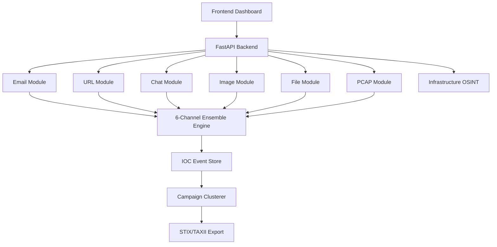

# Juwan CTI v3.0 — Comprehensive Project Summary

## 1. Executive Summary
Juwan CTI v3.0 is a state-of-the-art **Multi-modal Cyber Threat Intelligence Platform** designed to detect, analyze, and cluster threats across six distinct communication and data channels. By leveraging AI-driven detection (GPT-2, EfficientNet), static malware analysis (YARA/PE), and network forensics (Scapy), the platform provides a unified "Ensemble" threat score with high accuracy.

## 2. Platform Metrics & Technical Details
The system is built for scale and high-fidelity detection.

| Metric | Detail |
| :--- | :--- |
| **Analysis Channels** | 6 (Email, URL, Chat, Image, File, PCAP) |
| **URL Risk Signals** | 25 (Shannon Entropy, Domain Age, MIME Sniffing, etc.) |
| **Text AI-Origin Model** | GPT-2 (124M) Perplexity-based Stylometrics |
| **Image Analysis** | EfficientNet-B0 (Face detection) + Error Level Analysis (ELA) |
| **Clustering Logic** | 3-gram MinHash LSH (128 perms) via `datasketch` |
| **Forensics** | Static PE (pefile), YARA (Malware Rules), PCAP (Scapy) |
| **Data Throughput** | Distributed via Celery/Redis background workers |

## 3. Architecture Overview
The system follows a modular micro-services-style architecture using **FastAPI** on the backend and a **D3.js-powered glassmorphism dashboard** on the frontend. Data is persisted in a **PostgreSQL** IOC store, with **Celery/Redis** handling periodic tasks like campaign clustering and OSINT scraping.



## 3. Platform Statistics & Metrics
The dashboard provides a real-time fleet-wide view of threat activity.


*Metrics showing 130+ analyses with 6 HIGH and 43 MEDIUM risk indicators.*

## 4. Threat Scoring Spectrum: Phishing & Malicious Examples
The platform classifies threats into three primary risk tiers based on multi-channel indicators.

### 🔴 High Risk (90%+) - Clear Phishing Attacks
Direct alerts for confirmed malicious patterns and ensemble-validated threats.

````carousel

<!-- slide -->

<!-- slide -->

````

### 🟡 Medium Risk (40-60%) - Suspicious Indicators
Alerts for redirects, entropy anomalies, and infrastructure reputations.


*Example: Email flagged as Phishing with 50.0% confidence and MEDIUM threat level.*

### 🟢 Low Risk (<20%) - Legitimate Traffic
Filtered results for verified safe communications and infrastructure.

````carousel

<!-- slide -->

````

## 5. Technical Stack
| Component | Technology |
| :--- | :--- |
| **Backend** | Python 3.10+, FastAPI, Pydantic |
| **Database** | PostgreSQL 15, SQLAlchemy |
| **Caching/Tasks** | Redis, Celery |
| **AI Models** | GPT-2 (Text), EfficientNet (Image), XGBoost (URL) |
| **Analysis Libs** | Scapy, YARA, Pefile, OpenCV, Pyzbar |
| **Frontend** | Vanilla HTML/JS, CSS (Glassmorphism), D3.js |

---
*Documentation Updated on March 12, 2026.*
